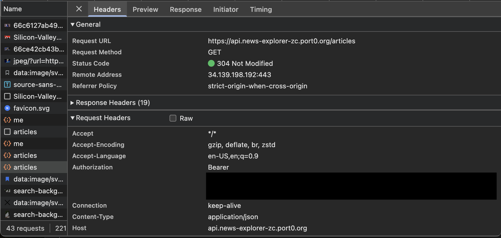

# News Explorer – Backend API

RESTful API built with Node.js, Express, and MongoDB to support user authentication and persistent storage of saved news articles.

---

## 🌍 Deployment

The backend API and MongoDB database are deployed on a cloud-hosted virtual machine.

---

## 📸 Screenshots




---

## 📌 Overview

This API powers the News Explorer application by handling user accounts and storing user-saved articles. Implements JWT authentication, protected routes, and structured data models.

---

## 🛠 Tech Stack

- Node.js
- Express
- MongoDB
- JWT Authentication

---

## ✨ Key Features

- User registration and login with JWT
- Protected routes for user-specific data
- CRUD operations for saved articles
- Request validation and centralized error handling
- Structured JSON API responses

---

## ⚙️ Run Locally

### Prerequisites

- Node.js (v23.x recommended — npm included)
- MongoDB (either a local instance OR a cloud connection string such as MongoDB Atlas)

### Setup

```bash
git clone https://github.com/Zchabot/news-explorer-backend.git
cd news-explorer-backend
npm install
```

### Environment Variables (Optional)

This project includes safe fallback defaults for local development, allowing the server to run without additional configuration.

- A local MongoDB database
- A development JWT secret
- Default server port **3002**

You may create a `.env` file to override these values for custom setups or production deployments.

Example:

MONGODB_URI=<your_mongodb_uri>
JWT_SECRET=<your_secret_key>
PORT=<custom_port>

Environment variables are optional for local development but recommended for production.

### Start Server

```bash
npm run start
```

The API will run at:
http://localhost:3002 if no custom port is specified.
